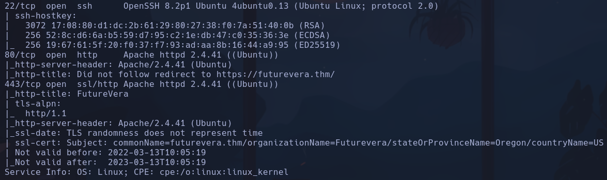
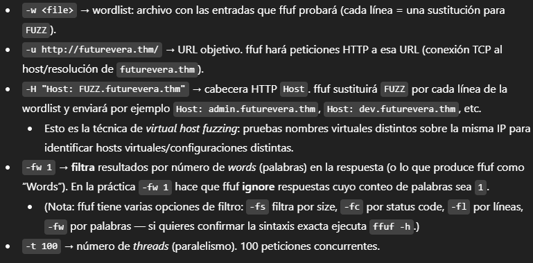
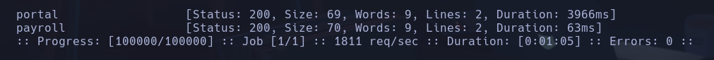
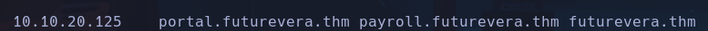
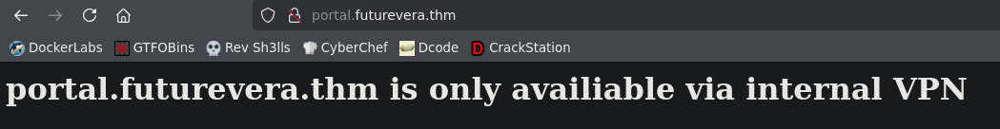
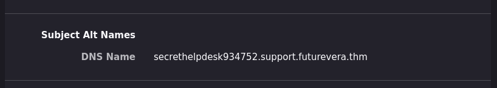

# TakeOver

Como no encontramos nada con Gobuster aplicamos un discovery de subdominios:
`ffuf -w /usr/share/seclists/Discovery/DNS/bitquark-subdomains-top100000.txt -u http://futurevera.thm/ -H "Host: FUZZ.futurevera.thm" -fw 1 -t 100`

Encontramos dos: portal y payroll

hay que añadirlos a /etc/hosts

portal y payroll necesitan vpn interna

intentamos gobuster para los nuevos subdominios pero no obtenemos nada importante

Como en la descripción se comenta que hay una pagina de soporte, intentaremos probar con support o help como subdominio (ffuz encuentra portal y payroll pero no aportan nada)

Al ver el certificado de support.futurevera.thm encontramos otro subdominio:

secrethelpdesk934752.support.futurevera.thm

Si escribimos http://secrethelpdesk934752.support.futurevera.thm
Encontraremos la flag en la url
**done**
