# Election:1

```bash
sudo arp-scan -I eth0 --localnet
```

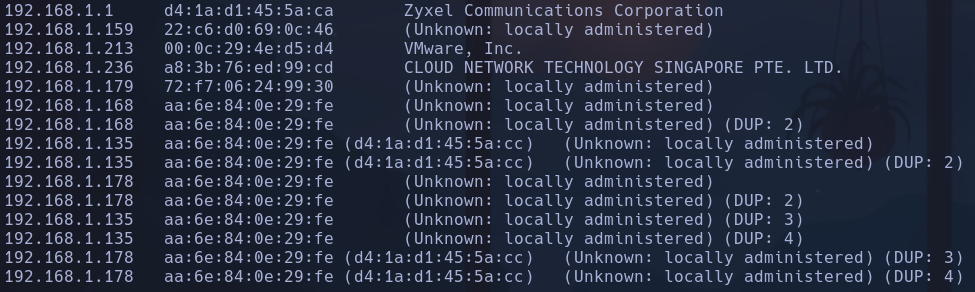

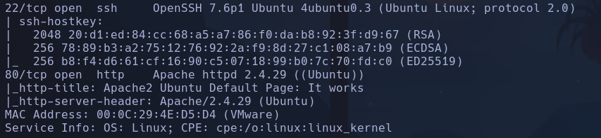

Openssh y apache -> launchpad -> codename es **Ubuntu Bionic**

Whatweb no reporta nada relevante

Hacemos un escaneo de scripts default en el puerto 80
```bash
nmap --script http-enum -p80 192.168.1.213
```

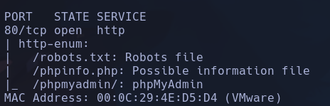

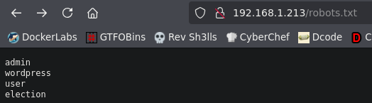

en /phpinfo.php podemos encontrar información relevante como algunas funciones que están deshabilitadas y que no se podrán usar en caso de subir código php

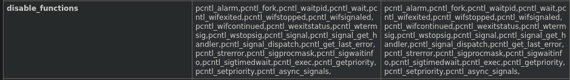

No están shell_exec, system, etc

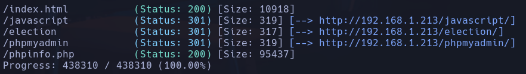

Parece que haciendo admin:admin en la pag myphpadmin nos enumera el usuario admin

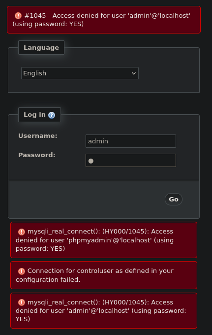

Intentamos por fuerza bruta con hydra pero nos da muchos falsos positivos:
```bash
hydra -l admin -P /usr/share/wordlists/rockyou.txt 192.168.1.213 http-post-form "/phpmyadmin:pma_username=admin&pma_password=^PASS^&server=1&target=index.php&token=433815b4ef6b84ea199775b5ee9c0535:F=Access denied for user" -V
```

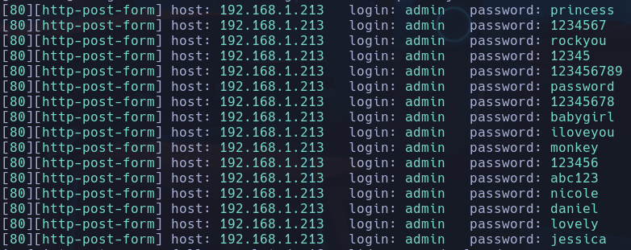

Posible usuario admin1


El directorio /election es un portal de una web, asique vuelvo a hacer *gobuster* sobre esa dirección

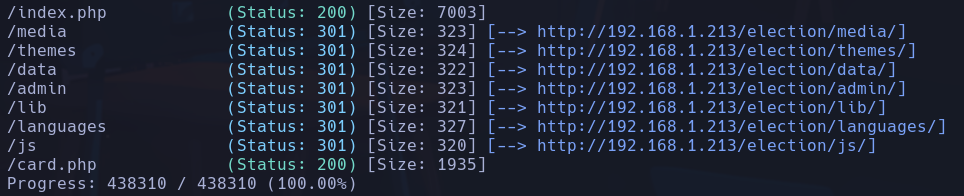

En /election/card.php encontramos un binario:

```text
00110000 00110001 00110001 00110001 00110000 00110001 00110000 00110001 00100000 00110000 00110001 00110001 00110001 00110000 00110000 00110001 00110001 00100000 00110000 00110001 00110001 00110000 00110000 00110001 00110000 00110001 00100000 00110000 00110001 00110001 00110001 00110000 00110000 00110001 00110000 00100000 00110000 00110000 00110001 00110001 00110001 00110000 00110001 00110000 00100000 00110000 00110000 00110001 00110001 00110000 00110000 00110000 00110001 00100000 00110000 00110000 00110001 00110001 00110000 00110000 00110001 00110000 00100000 00110000 00110000 00110001 00110001 00110000 00110000 00110001 00110001 00100000 00110000 00110000 00110001 00110001 00110000 00110001 00110000 00110000 00100000 00110000 00110000 00110000 00110000 00110001 00110000 00110001 00110000 00100000 00110000 00110001 00110001 00110001 00110000 00110000 00110000 00110000 00100000 00110000 00110001 00110001 00110000 00110000 00110000 00110000 00110001 00100000 00110000 00110001 00110001 00110001 00110000 00110000 00110001 00110001 00100000 00110000 00110001 00110001 00110001 00110000 00110000 00110001 00110001 00100000 00110000 00110000 00110001 00110001 00110001 00110000 00110001 00110000 00100000 00110000 00110001 00110000 00110001 00110001 00110000 00110001 00110000 00100000 00110000 00110001 00110001 00110001 00110001 00110000 00110000 00110000 00100000 00110000 00110001 00110001 00110000 00110000 00110000 00110001 00110001 00100000 00110000 00110000 00110001 00110001 00110000 00110000 00110000 00110001 00100000 00110000 00110000 00110001 00110001 00110000 00110000 00110001 00110000 00100000 00110000 00110000 00110001 00110001 00110000 00110000 00110001 00110001 00100000 00110000 00110000 00110001 00110000 00110000 00110000 00110000 00110001 00100000 00110000 00110001 00110000 00110000 00110000 00110000 00110000 00110000 00100000 00110000 00110000 00110001 00110000 00110000 00110000 00110001 00110001
```

Intentamos descifrarlo ->

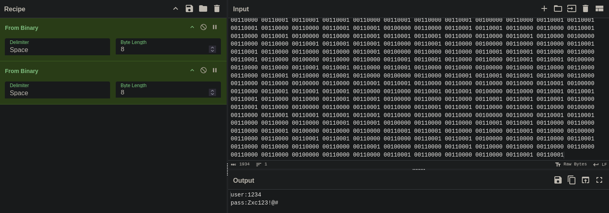

user:1234
pass:Zxc123!@#

En /election/lib

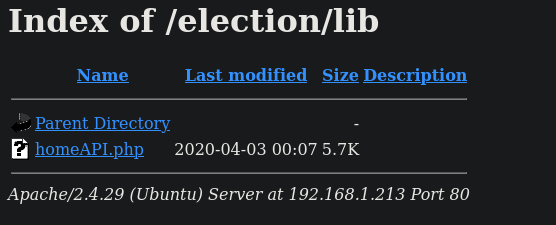

Parece que homeAPI.php no hace nada viendo la respuesta en burp

En /election/languages existen dos carpetas, /id-id de indonesia y /en/us en ingles
En /election/languages/en-us/info.tp

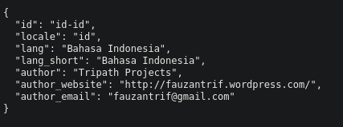

http://fauzantrif.wordpress.com/
fauzantrif@gmail.com

Estos archivos de languages parecen los distintos comnponentes de la web pero en distintos idiomas
/election/languages/en-us/loc_admin.tp encontramos todo tipo de información de logs de funcionamiento de la web, tanto para política de contraseñas, nombre de usuarios, accesos, etc
También botones como **btn_change_pass**

En /election/media/backgrounds/ encontramos dos imágenes las cuales necesitan salvoconducto para extraer

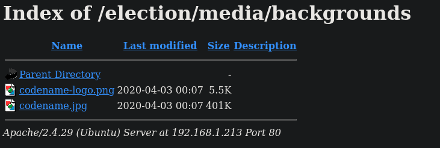

/election/admin

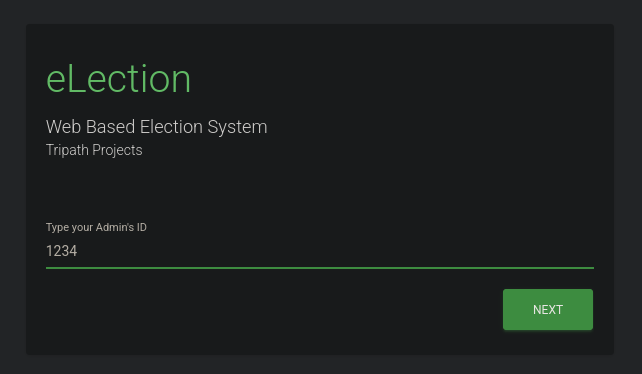

1234:Zxc123!@#
- Y estamos dentro del panel de administrador

Registramos un Staff para ser votado:

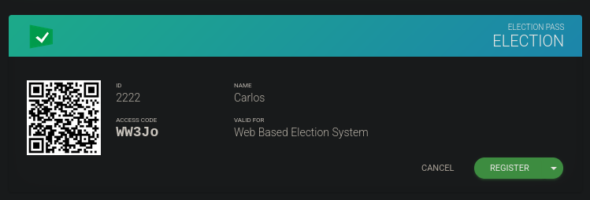

Sistema de votación comprobando peticiones con burp y no veo nada raro

Encuentro un sistema de webdesign llamado Artic fox

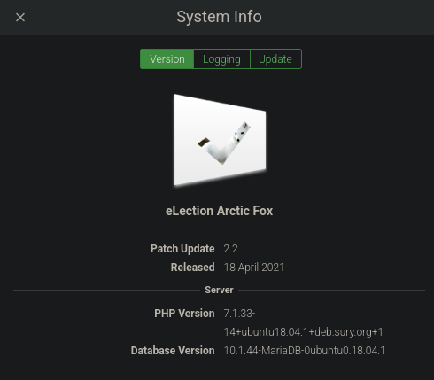

Parece algo del propio proyecto y no encuentro nada averiguo nada relevante

Probaremos con el Web based system -> Election

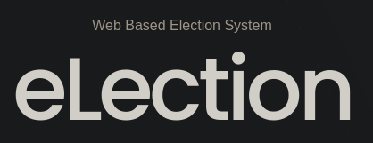

Nada

Intentamos volver a fuzzear pero con /election/admin

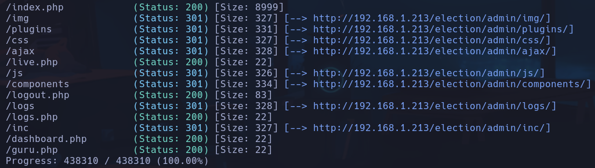

Encontramos archivos de logs
Vemos un system.log

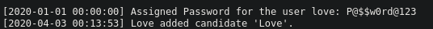

**`love:P@$$w0rd@123`**

Entramos por ssh
```bash
ssh love@192.168.1.213
```

**love**

## Escalada

```bash
lsb_release -a
```

Ubuntu bionic

/Desktop/user.txt
`cd38ac698c0d793a5236d01003f692b0`

En /var/www/html/election/admin/inc/conn.php

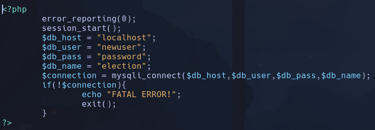

No encuentro nada importante en MariaDB a parte de los datos introducidos por mi en las tablas de la web

```bash
id
```

*uid=1000(love) gid=1000(love) groups=1000(love),4(adm),24(cdrom),30(dip),33(www-data),46(plugdev),116(lpadmin),126(sambashare)*
- Muchos grupos pero ninguno interesante

```bash
find / -perm -4000 -ls 2>/dev/null | grep -v snap
```

/home/love -> SUID a nivel de directorio no hace nada
/usr/local/Serv-U/Serv-U

- Buscamos que es Serv-U y encontramos que es un servidor ftp, además encontramos que Serv-U tiene un exploit en Exploit-db de local privilege escalation:
https://www.exploit-db.com/exploits/47009

Copiamos el exploit en un archivo llamado *servu_exploit.c*
```bash
nano servu_exploit.c
```

El exploit está en C, por lo que usaremos una función que traduce de c a binario de linux llamado gcc -> primero comprobamos que la máquina vulnerada tiene gcc con `which gcc`
```bash
gcc servu_exploit.c -o servu_exploit
./servu_exploit
```

**root**
5238feefc4ffe09645d97e9ee49bc3a6
